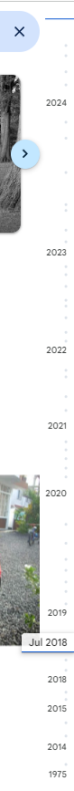

# Google Auto Albumizer

**AutoAlbumizer** is your ultimate Google Photos management tool, offering bulk uploads and intelligent album creation to keep your memories organized effortlessly.


### Why Use AutoAlbumizer?
- **Efficient Bulk Uploads**: Upload your photos to Google Photos in bulk and let AutoAlbumizer automatically create smart albums, saving you time and effort.
- **Automatic Album Creation**: Enjoy an organized photo library with ease as AutoAlbumizer combines bulk uploads with intelligent album creation.
- **Hassle-Free Organization**: Say goodbye to manual sorting! AutoAlbumizer's intelligent algorithms automatically organize your photos into albums as you upload them.
- **Intuitive User Experience**: Experience seamless album creation with AutoAlbumizer's intuitive interface, designed for ease of use and efficiency.

## Features

The tool operates through the following steps or stages:

### 1. Scan a Folder and Its Subdirectories

The **Scan** command scans a given directory and its subdirectories to create metadata. You can see how many folders and photos you have. The tool intelligently identifies the first subdirectory as the album name.

**Usage**:
1. Run the following command:
   ```bash
   python main.py --job scan --input-dir D:\GD\temp\01Old
   ```

### 2. Update EXIF Creation Date (Optional)

Have you noticed the timeline-scroll on the right? Almost all photo management tools have this feature to help you scroll across your timeline.



If you have digitized your old photos or somehow your original photo creation dates are incorrect, this step will help you update the photo creation date.

**Usage**:
1. Update creation dates for the required photos in the metadata.
2. Run the following command to update the EXIF creation date:
   ```bash
   python main.py --job exif
   ```

> **Note:** This step is optional.

### 3. Upload Photos to Google Albums

In this final step, review the metadata one more time and let AutoAlbumizer upload the photos for you, either by creating new albums or uploading them to existing ones.

**Usage**:
1. Review the metadata files.
2. Run the following command to upload photos:
   ```bash
   python main.py --job upload
   ```

## TODO

### Basic Functionalities

- Ensure that the basic workflow functions smoothly.

### Cross-Platform GUI

- We are working on a simple cross-platform GUI. If you have any suggestions, please feel free to reach out.

---

### Developers Guide:

#### Obtaining a Google Photos API key

- Obtain a Google Photos API key (Client ID and Client Secret) by following the instructions on [Getting started with Google Photos REST APIs](https://developers.google.com/photos/library/guides/get-started)
- Ensure Google Photo API is enabled for your google project.
- Download the 'client_secrets.json' file and keep it on the root folder.

#### Set up your environment

- Make sure you have [Python 3.7](https://www.python.org/downloads/) => installed on your system
- If needed, install pipenv via pip install pipenv
- After cloning the code run following commands to create the virtual environment and install dependencies

```bash
   pipenv install
   pipenv shell
   setup.bat
```
