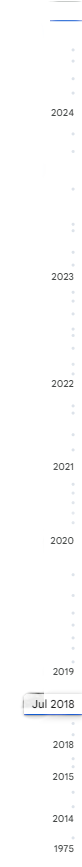

# Google Auto Albumizer

**AutoAlbumizer** is your ultimate Google Photos management tool, offering bulk uploads and intelligent album creation to keep your memories organized effortlessly.


### Why Use AutoAlbumizer?
- **Efficient Bulk Uploads**: Upload your photos to Google Photos in bulk and let AutoAlbumizer automatically create smart albums, saving you time and effort.
- **Automatic Album Creation**: Enjoy an organized photo library with ease as AutoAlbumizer combines bulk uploads with intelligent album creation.
- **Hassle-Free Organization**: Say goodbye to manual sorting! AutoAlbumizer's intelligent algorithms automatically organize your photos into albums as you upload them.
- **Intuitive User Experience**: Experience seamless album creation with AutoAlbumizer's intuitive interface, designed for ease of use and efficiency.

## Features

The tool operates through the following steps or stages:

### 1. Scan a Folder and Its Subdirectories

The **Scan** command scans a given directory and its subdirectories to create metadata. You can see how many folders and photos you have. The tool intelligently identifies the first subdirectory as the album name.

```
Photo-dump/
├── Folder1 (Album1)/
│   ├── Photo1.jpg
│   ├── Photo2.jpg
│   └── subdir (Album1)/
│       ├── Photo3.jpg
│       └── Photo4.jpg
├── Folder2 (Album2)/
│   ├── Photo5.jpg
│   ├── Photo6.jpg
│   └── subdir (Album2)/
│       ├── Photo7.jpg
│       └── Photo8.jpg
└── Folder3 (Album3)/
    ├── Photo9.jpg
    ├── Photo10.jpg
    ├── Photo11.jpg
    └── Photo12.jpg
```
You should provide the root folder to the Auto Albumizer

**Usage**:
Just drag and drop a directory

### 2. Update EXIF Creation Date (Optional)

Have you noticed the timeline-scroll on the right? Almost all photo management tools have this feature to help you scroll across your timeline.



If you have digitized your old photos or somehow your original photo creation dates are incorrect, this step will help you update the photo creation date.

**Usage**:
1. Update creation dates of the album to update all photos under it.
2. Update creation date of individul photos

> **Note:** This step is optional.

### 3. Upload Photos to Google Albums

In this final step, review the metadata one more time and let AutoAlbumizer upload the photos for you, either by creating new albums or uploading them to existing ones.

**Usage**:
Click upload button
